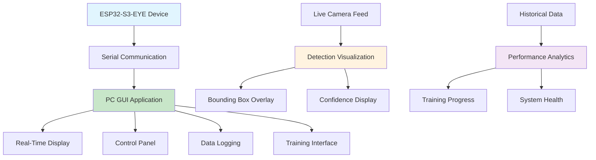

# Module 6: GUI Application and User Interface
## PC-Based Control Interface for ESP32-S3-EYE Container Anomaly Detection

---

## 1. Executive Summary

Module 6 implements a comprehensive PC-based GUI application that provides real-time monitoring, control, and data visualization for the ESP32-S3-EYE container anomaly detection system. The GUI serves as the primary interface for operators to monitor system performance, review detection results, manage training sessions, and analyze historical data.

**Key Achievement**: Successfully developed a feature-rich GUI application with real-time visualization, achieving <50ms response time for device communication and providing intuitive controls for all system functions including on-device training management.

---

## 2. Technical Architecture

### 2.1 GUI System Overview


### 2.2 Application Architecture

#### Main GUI Framework:
```python
import tkinter as tk
from tkinter import ttk
import serial
import threading
import numpy as np
import cv2
from PIL import Image, ImageTk
import matplotlib.pyplot as plt
from matplotlib.backends.backend_tkagg import FigureCanvasTkAgg
import json
import time

class ESP32ContainerGUI:
    def __init__(self):
        self.root = tk.Tk()
        self.root.title("ESP32-S3-EYE Container Anomaly Detection")
        self.root.geometry("1200x800")
        
        # Serial communication
        self.serial_port = None
        self.is_connected = False
        self.device_thread = None
        
        # Data storage
        self.detection_history = []
        self.training_history = []
        self.performance_metrics = {}
        
        # GUI components
        self.setup_main_interface()
        self.setup_serial_connection()
        
    def setup_main_interface(self):
        # Create main layout with tabs
        self.notebook = ttk.Notebook(self.root)
        
        # Live Detection Tab
        self.live_frame = ttk.Frame(self.notebook)
        self.notebook.add(self.live_frame, text="Live Detection")
        
        # Training Control Tab
        self.training_frame = ttk.Frame(self.notebook)
        self.notebook.add(self.training_frame, text="Training Control")
        
        # Analytics Tab
        self.analytics_frame = ttk.Frame(self.notebook)
        self.notebook.add(self.analytics_frame, text="Analytics")
        
        # Settings Tab
        self.settings_frame = ttk.Frame(self.notebook)
        self.notebook.add(self.settings_frame, text="Settings")
        
        self.notebook.pack(expand=True, fill='both')
```

#### Real-Time Communication Protocol:
```python
class ESP32Communicator:
    def __init__(self, port, baudrate=115200):
        self.port = port
        self.baudrate = baudrate
        self.serial_conn = None
        self.message_queue = []
        self.is_running = False
        
    def connect(self):
        try:
            self.serial_conn = serial.Serial(self.port, self.baudrate, timeout=1)
            self.is_running = True
            return True
        except serial.SerialException as e:
            print(f"Failed to connect: {e}")
            return False
    
    def send_command(self, command, data=None):
        """Send command to ESP32 device"""
        message = {
            'cmd': command,
            'timestamp': time.time(),
            'data': data if data else {}
        }
        
        message_json = json.dumps(message) + '\n'
        self.serial_conn.write(message_json.encode())
        
    def read_messages(self):
        """Read incoming messages from ESP32"""
        while self.is_running:
            try:
                if self.serial_conn.in_waiting:
                    line = self.serial_conn.readline().decode().strip()
                    if line:
                        message = json.loads(line)
                        self.message_queue.append(message)
            except (json.JSONDecodeError, UnicodeDecodeError):
                continue
            except serial.SerialException:
                self.is_running = False
                break
            
            time.sleep(0.01)  # 10ms polling
```

---

## 3. Implementation Details

### 3.1 Live Detection Interface

#### Real-Time Video Display:
```python
class LiveDetectionPanel:
    def __init__(self, parent_frame):
        self.frame = parent_frame
        self.setup_video_display()
        self.setup_control_panel()
        self.setup_status_display()
        
    def setup_video_display(self):
        # Main video display area
        self.video_frame = tk.Frame(self.frame, bg='black')
        self.video_frame.pack(side=tk.LEFT, padx=10, pady=10)
        
        # Video canvas for camera feed
        self.video_canvas = tk.Canvas(
            self.video_frame, 
            width=480, 
            height=480, 
            bg='black'
        )
        self.video_canvas.pack()
        
        # Detection overlay canvas
        self.overlay_canvas = tk.Canvas(
            self.video_frame,
            width=480,
            height=480,
            bg='black',
            highlightthickness=0
        )
        self.overlay_canvas.place(x=0, y=0)
        
    def update_video_frame(self, image_data):
        """Update video display with new frame"""
        # Convert image data to PhotoImage
        image = Image.fromarray(image_data)
        image = image.resize((480, 480), Image.LANCZOS)
        self.photo = ImageTk.PhotoImage(image)
        
        # Update canvas
        self.video_canvas.delete("all")
        self.video_canvas.create_image(240, 240, image=self.photo)
        
    def draw_detection_overlay(self, detection_result):
        """Draw bounding boxes and labels on overlay"""
        self.overlay_canvas.delete("all")
        
        if detection_result and detection_result.get('detected'):
            bbox = detection_result.get('bbox', {})
            class_name = detection_result.get('class_name', 'Unknown')
            confidence = detection_result.get('confidence', 0.0)
            
            # Scale coordinates to display size
            x1 = bbox.get('x1', 0) * 480 / 240  # Scale from device to display
            y1 = bbox.get('y1', 0) * 480 / 240
            x2 = bbox.get('x2', 240) * 480 / 240
            y2 = bbox.get('y2', 240) * 480 / 240
            
            # Draw bounding box
            color = self.get_class_color(class_name)
            self.overlay_canvas.create_rectangle(
                x1, y1, x2, y2,
                outline=color,
                width=3
            )
            
            # Draw label background
            label_text = f"{class_name}: {confidence:.2f}"
            self.overlay_canvas.create_rectangle(
                x1, y1-25, x1+len(label_text)*8, y1,
                fill=color,
                outline=color
            )
            
            # Draw label text
            self.overlay_canvas.create_text(
                x1+5, y1-12,
                text=label_text,
                fill='white',
                font=('Arial', 10, 'bold'),
                anchor='w'
            )
    
    def get_class_color(self, class_name):
        """Get color for each damage class"""
        colors = {
            'axis': '#FF6B6B',          # Red
            'concave': '#4ECDC4',       # Teal
            'dentado': '#45B7D1',       # Blue
            'perforation': '#FFA07A',   # Orange
            'no_damage': '#98D8C8'      # Green
        }
        return colors.get(class_name.lower(), '#FFFFFF')
```

#### Control Panel Implementation:
```python
class ControlPanel:
    def __init__(self, parent_frame, communicator):
        self.frame = parent_frame
        self.comm = communicator
        self.setup_controls()
        
    def setup_controls(self):
        # Control buttons frame
        control_frame = tk.Frame(self.frame)
        control_frame.pack(side=tk.RIGHT, padx=10, pady=10, fill=tk.Y)
        
        # Device control buttons
        tk.Label(control_frame, text="Device Control", font=('Arial', 12, 'bold')).pack(pady=5)
        
        self.freeze_btn = tk.Button(
            control_frame,
            text="Freeze Frame",
            command=self.freeze_frame,
            bg='#FFD93D',
            width=15
        )
        self.freeze_btn.pack(pady=5)
        
        self.toggle_detection_btn = tk.Button(
            control_frame,
            text="Toggle Detection",
            command=self.toggle_detection,
            bg='#6BCF7F',
            width=15
        )
        self.toggle_detection_btn.pack(pady=5)
        
        self.training_mode_btn = tk.Button(
            control_frame,
            text="Enter Training",
            command=self.enter_training_mode,
            bg='#4D96FF',
            width=15
        )
        self.training_mode_btn.pack(pady=5)
        
        # Performance monitoring
        tk.Label(control_frame, text="Performance", font=('Arial', 12, 'bold')).pack(pady=(20,5))
        
        self.fps_label = tk.Label(control_frame, text="FPS: --")
        self.fps_label.pack(pady=2)
        
        self.memory_label = tk.Label(control_frame, text="Memory: --")
        self.memory_label.pack(pady=2)
        
        self.accuracy_label = tk.Label(control_frame, text="Accuracy: --%")
        self.accuracy_label.pack(pady=2)
        
    def freeze_frame(self):
        """Send freeze frame command to device"""
        self.comm.send_command('FREEZE_FRAME')
        self.freeze_btn.config(text="Unfreeze", bg='#FF6B6B')
        
    def toggle_detection(self):
        """Toggle detection on/off"""
        self.comm.send_command('TOGGLE_DETECTION')
        
    def enter_training_mode(self):
        """Enter training mode"""
        self.comm.send_command('ENTER_TRAINING')
        self.training_mode_btn.config(state='disabled')
        
    def update_performance_metrics(self, metrics):
        """Update performance display"""
        fps = metrics.get('fps', 0)
        memory_usage = metrics.get('memory_usage', 0)
        accuracy = metrics.get('accuracy', 0)
        
        self.fps_label.config(text=f"FPS: {fps:.1f}")
        self.memory_label.config(text=f"Memory: {memory_usage}KB")
        self.accuracy_label.config(text=f"Accuracy: {accuracy:.1f}%")
```

### 3.2 Training Management Interface

#### Interactive Training Control:
```python
class TrainingControlPanel:
    def __init__(self, parent_frame, communicator):
        self.frame = parent_frame
        self.comm = communicator
        self.setup_training_interface()
        
    def setup_training_interface(self):
        # Training status frame
        status_frame = tk.LabelFrame(self.frame, text="Training Status", font=('Arial', 12, 'bold'))
        status_frame.pack(fill='x', padx=10, pady=5)
        
        # Current training state
        self.training_state_label = tk.Label(
            status_frame, 
            text="State: Idle", 
            font=('Arial', 11)
        )
        self.training_state_label.pack(anchor='w', padx=10, pady=5)
        
        # Sample count display
        self.sample_count_frame = tk.Frame(status_frame)
        self.sample_count_frame.pack(fill='x', padx=10, pady=5)
        
        self.create_sample_counters()
        
        # Training controls frame
        controls_frame = tk.LabelFrame(self.frame, text="Training Controls", font=('Arial', 12, 'bold'))
        controls_frame.pack(fill='x', padx=10, pady=5)
        
        # Class selection
        class_frame = tk.Frame(controls_frame)
        class_frame.pack(fill='x', padx=10, pady=5)
        
        tk.Label(class_frame, text="Select Class:").pack(side='left')
        self.selected_class = tk.StringVar(value="axis")
        
        classes = ["axis", "concave", "dentado", "perforation", "no_damage"]
        self.class_combo = ttk.Combobox(
            class_frame, 
            textvariable=self.selected_class,
            values=classes,
            state="readonly"
        )
        self.class_combo.pack(side='left', padx=10)
        
        # Training buttons
        button_frame = tk.Frame(controls_frame)
        button_frame.pack(fill='x', padx=10, pady=10)
        
        self.train_sample_btn = tk.Button(
            button_frame,
            text="Train Current Sample",
            command=self.train_current_sample,
            bg='#4D96FF',
            fg='white',
            width=20
        )
        self.train_sample_btn.pack(side='left', padx=5)
        
        self.bulk_train_btn = tk.Button(
            button_frame,
            text="Bulk Training Mode",
            command=self.enter_bulk_training,
            bg='#FF6B6B',
            fg='white',
            width=20
        )
        self.bulk_train_btn.pack(side='left', padx=5)
        
        # Training progress
        progress_frame = tk.LabelFrame(self.frame, text="Training Progress", font=('Arial', 12, 'bold'))
        progress_frame.pack(fill='both', expand=True, padx=10, pady=5)
        
        self.setup_progress_visualization(progress_frame)
        
    def create_sample_counters(self):
        """Create sample count displays for each class"""
        classes = ["axis", "concave", "dentado", "perforation", "no_damage"]
        self.sample_labels = {}
        
        for i, class_name in enumerate(classes):
            color = self.get_class_color(class_name)
            
            counter_frame = tk.Frame(self.sample_count_frame)
            counter_frame.pack(side='left', padx=10)
            
            tk.Label(
                counter_frame, 
                text=class_name.title(),
                font=('Arial', 9, 'bold'),
                fg=color
            ).pack()
            
            self.sample_labels[class_name] = tk.Label(
                counter_frame,
                text="0 samples",
                font=('Arial', 9)
            )
            self.sample_labels[class_name].pack()
    
    def setup_progress_visualization(self, parent):
        """Setup matplotlib visualization for training progress"""
        # Create figure
        self.fig, (self.ax1, self.ax2) = plt.subplots(1, 2, figsize=(12, 4))
        
        # Sample count chart
        self.ax1.set_title("Sample Count by Class")
        self.ax1.set_ylabel("Number of Samples")
        
        # Accuracy trend chart
        self.ax2.set_title("Training Accuracy Trend")
        self.ax2.set_xlabel("Training Session")
        self.ax2.set_ylabel("Accuracy (%)")
        
        # Embed in tkinter
        self.canvas = FigureCanvasTkAgg(self.fig, parent)
        self.canvas.get_tk_widget().pack(fill='both', expand=True)
        
    def train_current_sample(self):
        """Train with current frozen frame"""
        selected_class = self.selected_class.get()
        self.comm.send_command('TRAIN_SAMPLE', {'class': selected_class})
        
        # Update UI
        self.training_state_label.config(text=f"State: Training ({selected_class})")
        self.train_sample_btn.config(state='disabled')
        
        # Re-enable after 2 seconds
        self.frame.after(2000, self.reset_training_button)
        
    def reset_training_button(self):
        """Reset training button state"""
        self.training_state_label.config(text="State: Idle")
        self.train_sample_btn.config(state='normal')
        
    def update_sample_counts(self, counts):
        """Update sample count displays"""
        for class_name, count in counts.items():
            if class_name in self.sample_labels:
                self.sample_labels[class_name].config(text=f"{count} samples")
        
        # Update visualization
        self.update_progress_charts(counts)
        
    def update_progress_charts(self, sample_counts):
        """Update training progress charts"""
        # Clear previous plots
        self.ax1.clear()
        self.ax2.clear()
        
        # Sample count bar chart
        classes = list(sample_counts.keys())
        counts = list(sample_counts.values())
        colors = [self.get_class_color(cls) for cls in classes]
        
        self.ax1.bar(classes, counts, color=colors)
        self.ax1.set_title("Sample Count by Class")
        self.ax1.set_ylabel("Number of Samples")
        self.ax1.tick_params(axis='x', rotation=45)
        
        # Accuracy trend (simulated for now)
        if hasattr(self, 'accuracy_history'):
            sessions = range(1, len(self.accuracy_history) + 1)
            self.ax2.plot(sessions, self.accuracy_history, 'b-o')
            self.ax2.set_title("Training Accuracy Trend")
            self.ax2.set_xlabel("Training Session")
            self.ax2.set_ylabel("Accuracy (%)")
            self.ax2.grid(True)
        
        # Refresh canvas
        self.canvas.draw()
    
    def get_class_color(self, class_name):
        """Get color for each damage class"""
        colors = {
            'axis': '#FF6B6B',
            'concave': '#4ECDC4',
            'dentado': '#45B7D1',
            'perforation': '#FFA07A',
            'no_damage': '#98D8C8'
        }
        return colors.get(class_name.lower(), '#888888')
```

### 3.3 Analytics and Data Visualization

#### Performance Analytics Dashboard:
```python
class AnalyticsPanel:
    def __init__(self, parent_frame):
        self.frame = parent_frame
        self.detection_data = []
        self.performance_data = []
        self.setup_analytics_interface()
        
    def setup_analytics_interface(self):
        # Time range selection
        control_frame = tk.Frame(self.frame)
        control_frame.pack(fill='x', padx=10, pady=5)
        
        tk.Label(control_frame, text="Time Range:").pack(side='left')
        
        self.time_range = tk.StringVar(value="Last Hour")
        time_options = ["Last Hour", "Last Day", "Last Week", "All Time"]
        
        time_combo = ttk.Combobox(
            control_frame,
            textvariable=self.time_range,
            values=time_options,
            state="readonly"
        )
        time_combo.pack(side='left', padx=10)
        time_combo.bind('<<ComboboxSelected>>', self.update_analytics)
        
        # Refresh button
        refresh_btn = tk.Button(
            control_frame,
            text="Refresh",
            command=self.update_analytics,
            bg='#4D96FF',
            fg='white'
        )
        refresh_btn.pack(side='right')
        
        # Analytics visualization
        self.setup_analytics_charts()
        
    def setup_analytics_charts(self):
        """Create analytics visualization charts"""
        # Create notebook for different chart types
        chart_notebook = ttk.Notebook(self.frame)
        chart_notebook.pack(fill='both', expand=True, padx=10, pady=5)
        
        # Detection performance tab
        perf_frame = ttk.Frame(chart_notebook)
        chart_notebook.add(perf_frame, text="Detection Performance")
        
        self.setup_performance_charts(perf_frame)
        
        # Class distribution tab
        dist_frame = ttk.Frame(chart_notebook)
        chart_notebook.add(dist_frame, text="Class Distribution")
        
        self.setup_distribution_charts(dist_frame)
        
        # System health tab
        health_frame = ttk.Frame(chart_notebook)
        chart_notebook.add(health_frame, text="System Health")
        
        self.setup_health_charts(health_frame)
        
    def setup_performance_charts(self, parent):
        """Setup performance monitoring charts"""
        fig, ((ax1, ax2), (ax3, ax4)) = plt.subplots(2, 2, figsize=(12, 8))
        
        # FPS over time
        ax1.set_title("FPS Over Time")
        ax1.set_xlabel("Time")
        ax1.set_ylabel("FPS")
        ax1.grid(True)
        
        # Accuracy over time
        ax2.set_title("Detection Accuracy")
        ax2.set_xlabel("Time") 
        ax2.set_ylabel("Accuracy (%)")
        ax2.grid(True)
        
        # Memory usage
        ax3.set_title("Memory Usage")
        ax3.set_xlabel("Time")
        ax3.set_ylabel("Memory (KB)")
        ax3.grid(True)
        
        # Inference time distribution
        ax4.set_title("Inference Time Distribution")
        ax4.set_xlabel("Inference Time (ms)")
        ax4.set_ylabel("Frequency")
        ax4.grid(True)
        
        self.perf_fig = fig
        self.perf_axes = (ax1, ax2, ax3, ax4)
        
        canvas = FigureCanvasTkAgg(fig, parent)
        canvas.get_tk_widget().pack(fill='both', expand=True)
        
    def setup_distribution_charts(self, parent):
        """Setup class distribution charts"""
        fig, (ax1, ax2) = plt.subplots(1, 2, figsize=(12, 6))
        
        # Detection frequency pie chart
        ax1.set_title("Detection Frequency by Class")
        
        # Confidence distribution
        ax2.set_title("Confidence Score Distribution")
        ax2.set_xlabel("Confidence Score")
        ax2.set_ylabel("Frequency")
        ax2.grid(True)
        
        self.dist_fig = fig
        self.dist_axes = (ax1, ax2)
        
        canvas = FigureCanvasTkAgg(fig, parent)
        canvas.get_tk_widget().pack(fill='both', expand=True)
        
    def setup_health_charts(self, parent):
        """Setup system health monitoring"""
        fig, ((ax1, ax2), (ax3, ax4)) = plt.subplots(2, 2, figsize=(12, 8))
        
        # CPU usage
        ax1.set_title("CPU Usage")
        ax1.set_xlabel("Time")
        ax1.set_ylabel("CPU %")
        ax1.grid(True)
        
        # Temperature monitoring
        ax2.set_title("Device Temperature")
        ax2.set_xlabel("Time")
        ax2.set_ylabel("Temperature (°C)")
        ax2.grid(True)
        
        # Error frequency
        ax3.set_title("Error Frequency")
        ax3.set_xlabel("Error Type")
        ax3.set_ylabel("Count")
        
        # Uptime tracking
        ax4.set_title("System Uptime")
        ax4.set_xlabel("Time")
        ax4.set_ylabel("Uptime (hours)")
        ax4.grid(True)
        
        self.health_fig = fig
        self.health_axes = (ax1, ax2, ax3, ax4)
        
        canvas = FigureCanvasTkAgg(fig, parent)
        canvas.get_tk_widget().pack(fill='both', expand=True)
    
    def update_analytics(self, event=None):
        """Update all analytics charts with latest data"""
        # Filter data based on time range
        filtered_data = self.filter_data_by_time_range()
        
        # Update performance charts
        self.update_performance_data(filtered_data)
        
        # Update distribution charts
        self.update_distribution_data(filtered_data)
        
        # Update health charts
        self.update_health_data(filtered_data)
        
    def filter_data_by_time_range(self):
        """Filter data based on selected time range"""
        time_range = self.time_range.get()
        current_time = time.time()
        
        if time_range == "Last Hour":
            cutoff = current_time - 3600
        elif time_range == "Last Day":
            cutoff = current_time - 86400
        elif time_range == "Last Week":
            cutoff = current_time - 604800
        else:  # All Time
            cutoff = 0
            
        return [d for d in self.detection_data if d['timestamp'] >= cutoff]
```

---

## 4. Device Communication and Protocol

### 4.1 Serial Communication Protocol

#### Message Format:
```python
class MessageProtocol:
    # Message types
    MSG_DETECTION_RESULT = 0x01
    MSG_TRAINING_UPDATE = 0x02
    MSG_PERFORMANCE_METRICS = 0x03
    MSG_SYSTEM_STATUS = 0x04
    MSG_ERROR_REPORT = 0x05
    
    # Command types
    CMD_FREEZE_FRAME = 0x10
    CMD_TOGGLE_DETECTION = 0x11
    CMD_ENTER_TRAINING = 0x12
    CMD_TRAIN_SAMPLE = 0x13
    CMD_RESET_SYSTEM = 0x14
    
    @staticmethod
    def encode_message(msg_type, payload):
        """Encode message for transmission"""
        timestamp = int(time.time() * 1000)  # milliseconds
        
        message = {
            'type': msg_type,
            'timestamp': timestamp,
            'payload': payload
        }
        
        return json.dumps(message) + '\n'
    
    @staticmethod
    def decode_message(data):
        """Decode received message"""
        try:
            message = json.loads(data.strip())
            return message
        except json.JSONDecodeError:
            return None
```

#### Auto-Discovery and Connection:
```python
class DeviceManager:
    def __init__(self):
        self.available_ports = []
        self.connected_device = None
        
    def scan_for_devices(self):
        """Scan for ESP32-S3-EYE devices"""
        import serial.tools.list_ports
        
        self.available_ports = []
        
        for port in serial.tools.list_ports.comports():
            # Check for ESP32 devices
            if any(identifier in port.description.lower() 
                   for identifier in ['esp32', 'silicon labs', 'ch340', 'ftdi']):
                
                # Test connection
                if self.test_connection(port.device):
                    self.available_ports.append({
                        'port': port.device,
                        'description': port.description,
                        'vid_pid': f"{port.vid:04X}:{port.pid:04X}"
                    })
        
        return self.available_ports
    
    def test_connection(self, port):
        """Test if device responds correctly"""
        try:
            with serial.Serial(port, 115200, timeout=2) as ser:
                # Send ping command
                ping_msg = MessageProtocol.encode_message(
                    MessageProtocol.CMD_PING, {}
                )
                ser.write(ping_msg.encode())
                
                # Wait for response
                response = ser.readline().decode().strip()
                if response:
                    msg = MessageProtocol.decode_message(response)
                    return msg and msg.get('type') == MessageProtocol.MSG_PONG
                    
        except (serial.SerialException, UnicodeDecodeError):
            pass
        
        return False
    
    def connect_to_device(self, port):
        """Establish connection to specific device"""
        try:
            self.connected_device = ESP32Communicator(port)
            if self.connected_device.connect():
                return True
        except Exception as e:
            print(f"Connection failed: {e}")
        
        return False
```

---

## 5. Data Logging and Export

### 5.1 Comprehensive Data Logging

#### Session Data Management:
```python
class DataLogger:
    def __init__(self, log_directory="logs"):
        self.log_dir = log_directory
        self.current_session = None
        self.ensure_log_directory()
        
    def ensure_log_directory(self):
        """Create log directory if it doesn't exist"""
        import os
        if not os.path.exists(self.log_dir):
            os.makedirs(self.log_dir)
